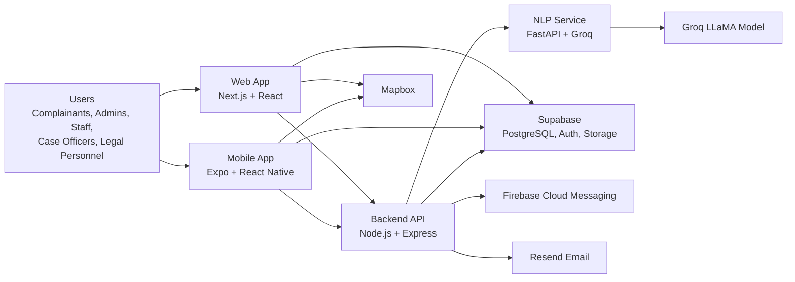
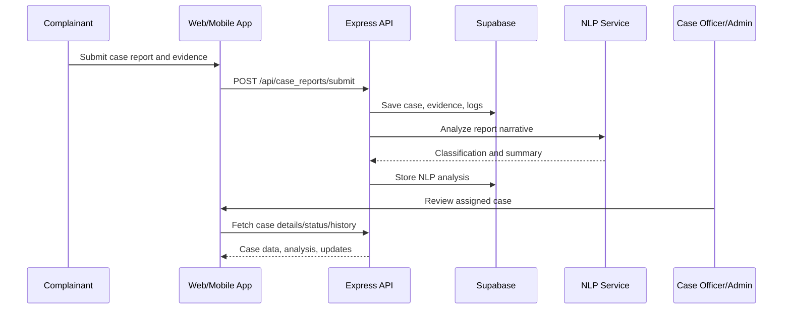
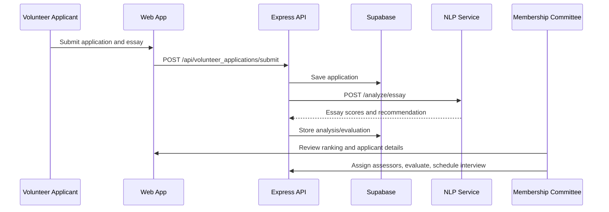
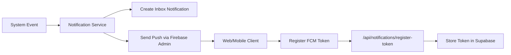

# SAVIRA System Documentation

SAVIRA is a multi-platform Sexual Violence Case Management Information System for SASHA. It supports confidential case reporting, case officer workflows, legal review, volunteer application evaluation, project tracking, heatmap visualization, notifications, support messaging, and reporting.

The repository is organized as a monorepo with four major application areas:

- `web/frontend` - Next.js web application
- `web/backend` - Node.js/Express API
- `web/nlp` - Python FastAPI NLP microservice
- `mobile` - Expo React Native mobile application

## 1. High-Level Architecture



SAVIRA follows a client-server architecture. The web and mobile clients provide role-based interfaces. The Express backend centralizes business rules, access control, file uploads, notifications, email, and database operations. Supabase is the primary cloud data platform. The NLP service is separate so text analysis can be scaled or deployed independently.

## 2. Cloud Architecture

### Frontend Hosting

The web frontend is a Next.js application under `web/frontend`. It is designed for deployment on a Node-compatible frontend host such as Vercel. It uses public environment variables for API, Supabase, Mapbox, and Firebase client configuration.

Primary frontend environment variables:

- `NEXT_PUBLIC_API_URL` - backend API base URL
- `NEXT_PUBLIC_SUPABASE_URL` - Supabase project URL
- `NEXT_PUBLIC_SUPABASE_ANON_KEY` - Supabase anonymous client key
- `NEXT_PUBLIC_MAPBOX_TOKEN` - Mapbox token for maps and heatmap visualization
- `NEXT_PUBLIC_FIREBASE_*` - Firebase browser messaging configuration

### Backend Hosting

The backend API is under `web/backend`. It can run as a long-running Node service. The repository includes:

- `railway.toml` with `startCommand = "node src/index.js"`
- `vercel.json` for serverless-style deployment through `@vercel/node`

The current sample frontend environment points to:

```text
https://savira-axion-production.up.railway.app
```

That indicates Railway is the intended production backend host.

Primary backend environment variables:

- `PORT` - backend port, defaults to `5000`
- `FRONTEND_URL` - comma-separated allowed frontend origins for CORS
- `SUPABASE_URL` - Supabase project URL
- `SUPABASE_SERVICE_ROLE_KEY` - privileged Supabase backend key
- `RESEND_API_KEY` - enables transactional emails
- `FIREBASE_SERVICE_ACCOUNT_PATH` - optional path to Firebase Admin SDK credentials
- NLP service URL variables may be used by `web/backend/src/services/nlp.service.js`

### NLP Service Hosting

The NLP microservice is under `web/nlp`. It runs with FastAPI and Uvicorn on port `8000` by default.

Runtime command:

```bash
uvicorn main:app --host 0.0.0.0 --port 8000
```

It exposes:

- `GET /` - service status
- `GET /health` - health check
- `POST /analyze` - case report NLP analysis
- `POST /analyze/essay` - volunteer essay evaluation

### Database, Auth, and Storage

Supabase is the central backend platform:

- PostgreSQL stores system records.
- Supabase Auth is used for account identity.
- Supabase Storage is used for uploaded files such as evidence, profile photos, support attachments, and project images.
- The backend uses the service role key through `@supabase/supabase-js` for privileged server-side operations.

### Push Notifications

Firebase Cloud Messaging is used for web/mobile push notifications. The backend uses `firebase-admin` and initializes only when a valid service account file exists. If the file is missing, notification sending is disabled gracefully.

### Email

Resend is used for email delivery:

- Password reset email
- Welcome email
- Verification code email
- Support reply email

If `RESEND_API_KEY` is missing or a placeholder, the backend logs the intended email instead of sending.

### Maps and Heatmap

Mapbox is used by web and mobile clients. SAVIRA stores NCR geography assets in both web and mobile codebases and uses backend heatmap endpoints to provide case distribution data.

## 3. Frameworks and Libraries

### Root Workspace

- Node.js monorepo
- `concurrently` for running backend, frontend, and mobile together

Main scripts:

- `npm run install:all` - install root, backend, frontend, and mobile dependencies
- `npm run dev` - run backend, frontend, and mobile
- `npm run dev:web` - run backend and frontend
- `npm run dev:mobile` - run Expo mobile app

### Web Frontend

Location: `web/frontend`

Frameworks and libraries:

- Next.js 16
- React 19
- Bootstrap 5
- CSS Modules
- Supabase JavaScript SDK
- Mapbox GL JS
- Firebase browser SDK
- React Calendar
- React Icons
- ESLint with Next.js config

### Backend API

Location: `web/backend`

Frameworks and libraries:

- Node.js
- Express 5
- CORS
- Cookie Parser
- Dotenv
- Supabase JavaScript SDK
- JSON Web Token
- Bcrypt/BcryptJS
- Express Validator
- Multer for file uploads
- Firebase Admin SDK
- Resend
- UUID
- Nodemon for development

### NLP Service

Location: `web/nlp`

Frameworks and libraries:

- FastAPI
- Uvicorn
- Groq SDK
- Microsoft Presidio Analyzer
- Microsoft Presidio Anonymizer
- spaCy
- NLTK
- Langdetect
- Python Dotenv
- PySpellChecker

### Mobile App

Location: `mobile`

Frameworks and libraries:

- Expo
- Expo Router
- React Native
- React 19
- NativeWind
- Async Storage
- Supabase JavaScript SDK
- Expo Document Picker
- Expo Image Picker
- Expo Location
- React Native WebView
- React Native Calendars
- React Native Gesture Handler
- React Native Safe Area Context
- React Native Screens

## 4. Repository Structure

```text
SAVIRA-AXION/
  app.json
  eas.json
  package.json
  README.md
  RUN_GUIDE.md
  HEATMAP_FEATURE.md
  mobile/
    app/
    assets/
    components/
    lib/
    plugins/
  web/
    backend/
      migrations/
      src/
        config/
        controllers/
        middleware/
        models/
        routes/
        services/
    frontend/
      public/
      src/
        app/
        components/
        hooks/
        lib/
        utils/
    nlp/
      main.py
      pipeline/
```

## 5. Backend Architecture

The backend entry point is `web/backend/src/index.js`. It creates an Express app, configures CORS, JSON body parsing, cookies, and mounts all route modules under `/api`.

### Backend Layers

- Routes define HTTP endpoints and attach middleware.
- Middleware handles authentication, authorization, validation, and module-specific access checks.
- Controllers handle request logic and coordinate model/service calls.
- Models perform Supabase table operations.
- Services contain cross-cutting logic such as NLP calls, duplicate detection, heatmap processing, and notifications.
- Config modules initialize Supabase, Firebase Admin, mailer, and geography constants.

### CORS Behavior

Allowed origins include:

- `http://localhost:3000`
- `http://127.0.0.1:3000`
- `http://localhost:3001`
- `http://127.0.0.1:3001`
- Origins in `FRONTEND_URL`
- Any localhost origin in non-production mode

Credentials are enabled, so the API supports cookie-based flows as well as bearer tokens.

### Authentication and Authorization

Authentication is handled by JWT middleware. Frontend requests include:

```text
Authorization: Bearer <token>
```

Role-based authorization appears throughout the routes. Supported role labels include:

- Admin
- Staff
- Project Officer
- Case Officer
- Legal Personnel
- User / Complainant

Additional access middleware narrows permissions for sensitive workflows:

- `requireCaseReportAccess`
- `requireVolunteerApplicationAccess`
- `requireProjectManager`
- `requireCommittee`
- `requireCaseReportAccess`
- Case report validation middleware
- Auth validation middleware

## 6. API Module Inventory

All backend modules are mounted under `/api`.

### Authentication

Base path: `/api/auth`

Responsibilities:

- Signup
- Signup verification
- Login
- Login verification
- Verification resend
- Email change request and verification
- Expired password change
- Logout
- Current user profile through `/me`
- Admin environment debugging through `/debug-env`

### Users and Role Management

Base paths:

- `/api/users`
- `/api/roles`
- `/api/staff`
- `/api/availability`
- `/api/case_officers`
- `/api/legal_personnels`
- `/api/complainants`
- `/api/committees`
- `/api/organizations`

Responsibilities:

- User creation, listing, update, password changes, avatar upload
- Role synchronization
- Staff records
- Staff availability
- Case officer records
- Legal personnel records
- Complainant records
- Committee records
- Organization profile data

### Case Management

Base paths:

- `/api/case_reports`
- `/api/case_assessments`
- `/api/evidences`
- `/api/case_types`
- `/api/case_status`
- `/api/case_report_logs`
- `/api/case_report_analysis`
- `/api/case_assignments`
- `/api/case_status_history`
- `/api/follow-ups`
- `/api/user_case_logs`

Responsibilities:

- Case submission
- Evidence upload and retrieval
- Case listing and detail retrieval
- User report history
- Case officer assignment and bulk assignment
- Case assessment and assessment action records
- Case status tracking
- Status change approval and rejection
- Case logs
- NLP analysis retrieval
- Duplicate match dismissal
- Follow-up messages and file attachments
- Case withdrawal and undo withdrawal
- Public updates visible to complainants
- Heatmap metadata and case distribution data

### Legal Review

Base paths:

- `/api/legal_case_assignments`
- `/api/legal_reviews`

Responsibilities:

- Assign cases to legal personnel
- Bulk legal assignment
- Remove assignments
- Retrieve assignments by case
- Retrieve and update legal review details
- Retrieve legal review calendar data

### Volunteer Application Management

Base paths:

- `/api/volunteer_applicants`
- `/api/volunteer_applications`
- `/api/screening_questions`
- `/api/screening_question_set`
- `/api/screening_answers`
- `/api/volunteer_application_analysis`
- `/api/volunteer_application_evaluations`
- `/api/volunteer_application_assignments`

Responsibilities:

- Volunteer applicant records
- Volunteer application submission
- Application status and history
- Membership committee review
- Screening question sets
- Screening question ordering and versioning
- Screening answers
- Assessor assignment and bulk assignment
- Essay evaluation
- Interview evaluation
- Score calculation
- Applicant ranking
- NLP analysis retrieval
- Application withdrawal and undo withdrawal

### Interviews

Base paths:

- `/api/interviews`
- `/api/interview_slots`

Responsibilities:

- Create interviews
- Retrieve interviews
- Expire stale interviews
- Select interview slot
- Reschedule interview
- Accept reschedule
- Request new slots
- Reopen slot selection
- Confirm, complete, cancel, or reject interview
- Unassign staff
- Create, update, bulk-create, and delete interview slots

The same interview infrastructure supports case interviews and volunteer interviews, with access narrowed by route middleware and slot type rules.

### Project Management

Base paths:

- `/api/projects`
- `/api/project-tasks`

Responsibilities:

- Project creation, update, retrieval, deletion
- Project image upload
- Bulk project deletion
- Task creation inside projects
- Task listing by project or globally
- Task update and cancellation
- Task activity logs
- Project-manager access enforcement

### Chapter Building

Base path: `/api/chapters`

Responsibilities:

- Chapter listing
- Chapter detail retrieval
- Chapter creation
- Chapter update
- Chapter deletion

### Notifications

Base path: `/api/notifications`

Responsibilities:

- Notification inbox retrieval
- Mark one notification as read
- Mark all notifications as read
- Delete one or all notifications
- Register and unregister Firebase push tokens

### Support

Base path: `/api/support`

Responsibilities:

- Public contact messages
- Authenticated bug/problem reports
- Support attachment upload
- Support message listing
- Staff/admin reply
- Resolve support messages
- Archive support messages

### Reports and Analytics

Base path: `/api/reports`

Responsibilities:

- Aggregate reports
- Case reports
- Volunteer reports
- Project reports
- User reports

## 7. Frontend Architecture

The web app uses the Next.js App Router. Pages are stored under `web/frontend/src/app`, while reusable components are stored under `web/frontend/src/components`.

### Web App Shared Libraries

Important files:

- `src/lib/api.js` - helper functions for backend API calls
- `src/lib/config.js` - API URL configuration
- `src/lib/supabase.js` - Supabase client setup
- `src/lib/firebase.js` - Firebase client setup
- `src/lib/AuthContext.js` - authentication context
- `src/lib/notificationStore.js` - notification state helpers
- `src/lib/ncrGeography.js` - NCR geographic data helpers
- `src/lib/choroplethUtils.js` - heatmap/choropleth utilities
- `src/lib/dashboardDeadlines.js` - dashboard deadline logic
- `src/lib/caseWithdrawal.js` - case withdrawal helpers
- `src/components/navigation/navigationLinks.js` - role-based navigation map

### Web Role-Based Navigation

The frontend maps role names into navigation groups:

- Public visitors: home, about, events, contact, volunteer, heatmap, support resources
- Complainants: dashboard, report, report history, volunteer application, events, heatmap, resources, settings
- Case Officers: dashboard, cases, interviews, heatmap, settings
- Staff: projects, project tasks, volunteers if membership committee, events, heatmap, settings
- Legal Personnel: dashboard, legal review, heatmap, settings
- Admin: users, cases, legal, volunteers, projects, project tasks, heatmap, support messages, reports, settings

### Major Web Pages

Public and account pages:

- `/`
- `/about`
- `/events`
- `/events/[slug]`
- `/contact`
- `/login`
- `/signup`
- `/verify-email`
- `/forgotPassword`
- `/resetPassword`
- `/change-password`
- `/privacy`
- `/terms`
- `/logout`

Support/resource pages:

- `/hospital`
- `/police-station`
- `/helplines`
- `/support-messages`
- `/settings`

Operational pages:

- `/dashboard`
- `/cases`
- `/cases/view`
- `/cases/history`
- `/caseInterviews`
- `/legalReviews`
- `/legalReviews/view`
- `/legalReviews/calendar`
- `/projects`
- `/projects/view`
- `/projectTasks`
- `/projectTasks/admin`
- `/users`
- `/staffAvailability`
- `/reportGenerator`
- `/heatmap`

Volunteer pages:

- `/volunteer`
- `/volunteer/apply`
- `/volunteer/view`
- `/volunteer/history`
- `/volunteerRanking`
- `/volunteerInterviews`
- `/volunteer/screening-questions`
- `/volunteer/screening-questions/history`
- `/volunteer/chapters`
- `/volunteer/chapters/create`
- `/volunteer/chapters/edit`
- `/volunteer/chapters/view`

## 8. Mobile Architecture

The mobile app is an Expo Router application under `mobile/app`.

### Mobile Configuration

Important files:

- `mobile/app.config.js` - Expo config extension
- `mobile/app.json` - Expo app metadata
- `mobile/lib/config.js` - API and Mapbox token config
- `mobile/lib/supabase.js` - Supabase mobile client
- `mobile/lib/session.js` - session helpers
- `mobile/lib/notifications.js` - notification helpers
- `mobile/lib/policies.js` - privacy/terms content helpers
- `mobile/lib/displayPreferences.js` - accessibility/display preferences

The mobile app uses:

- `EXPO_PUBLIC_API_URL`
- `EXPO_PUBLIC_MAPBOX_TOKEN`
- Expo `extra.apiUrl`
- Expo `extra.mapboxToken`

If no API URL is provided, the mobile app defaults to:

```text
https://www.saviraphilippines.org
```

### Mobile Screen Groups

Authentication:

- Splash
- Login
- Signup
- Verify email
- Forgot password
- Change password

Complainant app:

- Dashboard
- Report list
- Report detail
- Support
- Notifications
- Settings
- Search
- Privacy and terms
- Helplines
- Heatmap
- Events
- Event detail
- Contact
- About

## 9. NLP Architecture

The NLP service is intentionally separate from the Node API. This reduces load on the main API and isolates AI-specific dependencies.

### Case Report Analysis Pipeline

Endpoint: `POST /analyze`

Input includes:

- `case_report_id`
- `incident_description`
- `incident_location`
- `incident_city`
- `action_requested`

Pipeline:

1. Combine report description and requested action.
2. Validate that report text is present.
3. Anonymize personally identifiable information using Presidio.
4. Detect over-masking. If anonymization removes too much context, use the original text for Groq input while still returning anonymized text for storage.
5. Detect language.
6. Send natural-language text to Groq for structured analysis.
7. Return classification, summary, recommended steps, referral suggestion, clarity score, and report structure.

Returned analysis fields include:

- Model used
- Language detected
- Anonymized text
- Detected PII
- Primary categories
- Case types
- Classification notes
- Summary
- Recommended steps
- Referral suggestion and notes
- Clarity score
- Clarification flag and reason
- Report structure

### Volunteer Essay Evaluation Pipeline

Endpoint: `POST /analyze/essay`

Input includes:

- `volunteer_application_id`
- `essay_response`

Pipeline:

1. Sanitize control characters from essay text.
2. Skip anonymization because volunteer essays are intentional self-disclosures.
3. Preprocess for language detection.
4. Grade the clean essay with Groq.
5. Return score breakdown, notes, recommendation, and threshold result.

Score dimensions:

- Mission alignment
- Maturity and judgment
- Commitment
- Writing clarity
- Relevant experience

## 10. Data and Storage Model

The repository includes migrations under `web/backend/migrations`, which show ongoing database evolution.

Implemented database areas include:

- Users and roles
- Staff, case officers, legal personnel, complainants, committees
- Cases and case reports
- Evidence attachments
- Case assignments
- Case assessments
- Case status and status history
- Case report logs
- Case report NLP analysis
- Follow-ups and support attachments
- Volunteer applicants and applications
- Volunteer application assignments
- Volunteer application evaluations
- Volunteer application NLP analysis
- Screening questions, answers, and question sets
- Interviews and interview slots
- Legal case assignments and reviews
- Organizations
- Projects and project tasks
- Notifications inbox
- Profile photo storage and timestamps
- Password reset and email verification support

File storage areas are handled through Supabase Storage and upload middleware. Current upload-related workflows include:

- Evidence files
- Follow-up attachments
- Case withdrawal affidavits
- User avatars/profile photos
- Project images
- Support message attachments

## 11. Main User Workflows

### Case Reporting Workflow



### Volunteer Application Workflow



### Notification Workflow



## 12. Security and Privacy Controls

SAVIRA handles sensitive case information, so privacy and access control are core concerns.

Current controls in the codebase:

- JWT authentication for protected API routes
- Role-based authorization middleware
- Case-specific access middleware
- Volunteer-application-specific access middleware
- Committee-specific access for membership committee workflows
- Project-manager access checks
- Backend-only Supabase service role key
- CORS allowlist
- PII anonymization before NLP storage/output for case reports
- File upload handling through Multer
- Email verification and password reset flows
- Optional Firebase Admin initialization so missing credentials do not crash the API

Recommended production hardening:

- Keep `SUPABASE_SERVICE_ROLE_KEY` server-only.
- Enforce strict production `FRONTEND_URL`.
- Store Firebase service account credentials as secure deployment secrets.
- Review Supabase Row Level Security policies for every sensitive table.
- Apply malware/file-type scanning for evidence uploads if required by deployment policy.
- Ensure NLP prompts and logs never expose raw sensitive narratives unnecessarily.
- Enable HTTPS everywhere.
- Monitor failed login and suspicious access attempts.

## 13. Deployment and Operations

### Local Development

Install all dependencies:

```bash
npm run install:all
```

Run web and backend:

```bash
npm run dev:web
```

Run all app surfaces:

```bash
npm run dev
```

Run mobile only:

```bash
npm run dev:mobile
```

Expected local URLs:

- Web frontend: `http://localhost:3000`
- Backend API: `http://localhost:5000`
- NLP service: `http://localhost:8000`
- Mobile: Expo QR through Expo Go or development build

### Mobile Builds

EAS configuration supports:

- Development builds
- Preview/internal builds
- Production builds with auto-increment
- Android preview APK builds in `mobile/eas.json`

## 14. Module-to-Folder Map

| System Area | Frontend | Backend | Mobile |
| --- | --- | --- | --- |
| Authentication | `src/app/login`, `signup`, `verify-email`, password pages | `auth`, `users` routes/controllers | `app/(auth)` |
| Dashboard | `src/app/dashboard`, `components/dashboard` | reports and role-specific APIs | `app/(complainant)/dashboard.js` |
| Case Management | `src/app/cases`, `components/cases` | case reports, assessments, evidence, assignments, status, logs | reports and report detail screens |
| Legal Review | `src/app/legalReviews`, `components/legalReviews` | legal reviews, legal assignments | not primary mobile surface |
| Volunteer Management | `src/app/volunteer*`, volunteer components | volunteer applicants, applications, evaluations, assignments, screening | volunteer public/application references |
| Interviews | `caseInterviews`, `volunteerInterviews`, interview components | interviews, interview slots | not primary mobile surface |
| Projects | `projects`, `projectTasks`, project components | projects, project tasks | not primary mobile surface |
| Heatmap | `src/app/heatmap`, geography libs | case report heatmap services | `app/(complainant)/heatmap.js`, mobile geojson assets |
| Notifications | notification hooks/components | notifications service/routes | notification lib/screens |
| Support | contact/settings/support messages | support routes/controllers | support screen |
| Reports | report generator component/page | reports routes/controllers | not primary mobile surface |

## 15. Important Notes and Current Assumptions

- The repository contains both Railway and Vercel backend deployment files. The frontend sample points to Railway, so Railway appears to be the active backend deployment target.
- The frontend uses `NEXT_PUBLIC_API_URL`; the sample also includes `BACKEND_URL`, but `src/lib/config.js` reads `NEXT_PUBLIC_API_URL`.
- The mobile app default API URL is `https://www.saviraphilippines.org` unless overridden by Expo public env or Expo config.
- The backend uses a Supabase service role key, so backend routes must be treated as the trusted boundary.
- The NLP service should be deployed privately where possible, with only the backend allowed to call it.

